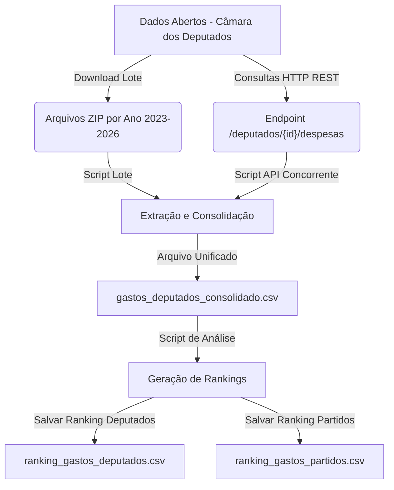

# Documentação de Desenvolvimento: Extração e Análise de Gastos dos Deputados

Esta documentação registra a arquitetura, os scripts desenvolvidos e as principais conclusões obtidas a partir da extração e do processamento dos dados de despesas da **Cota para Exercício da Atividade Parlamentar (CEAP)** da Câmara dos Deputados do Brasil para o mandato corrente (2023–2026).

---

## 🏗️ Fluxo e Arquitetura de Dados

O projeto foi construído para lidar com grandes volumes de dados de despesas governamentais de duas maneiras diferentes (API REST e Download em Lote). Abaixo está o fluxo de processamento de ponta a ponta:



---

## 🛠️ Scripts Desenvolvidos

Todos os arquivos estão localizados no diretório local `C:\Users\Victor Guida\Documents\Python\`.

### 1. Script de Lote (Recomendado pela Performance)
*   **Arquivo**: [obter_gastos_deputados_lote.py](file:///C:/Users/Victor%20Guida/Documents/Python/obter_gastos_deputados_lote.py)
*   **Método**: Efetua o download dos arquivos compactados (.zip) contendo as bases de dados consolidadas por ano (CEAP), descompacta-os temporariamente, faz o parse e saneamento dos campos, e mescla tudo em um único arquivo de saída.
*   **Vantagem**: Muito rápido. Reduz o tempo de extração de vários minutos para cerca de **17 segundos** para mais de 730 mil registros.

### 2. Script via API REST
*   **Arquivo**: [obter_gastos_deputados.py](file:///C:/Users/Victor%20Guida/Documents/Python/obter_gastos_deputados.py)
*   **Método**: Consulta a lista de deputados da legislatura especificada e executa requisições concorrentes em múltiplos threads (`ThreadPoolExecutor`) no endpoint `/deputados/{id}/despesas` para cada ano do mandato.
*   **Vantagem**: Ideal para realizar filtros online ou dinâmicos de deputados específicos direto do servidor.

### 3. Script de Análise de Gastos
*   **Arquivo**: [analise_gastos.py](file:///C:/Users/Victor%20Guida/Documents/Python/analise_gastos.py)
*   **Método**: Lê o CSV unificado, faz a agregação dos gastos líquidos por ID do deputado e partido político, ordena os dados de forma decrescente e gera dois relatórios analíticos em CSV.

---

## 📊 Estrutura dos Arquivos de Dados

### CSV Consolidado Geral
*   **Arquivo**: [gastos_deputados_consolidado.csv](file:///C:/Users/Victor%20Guida/Documents/Python/gastos_deputados_consolidado.csv) (Tamanho: ~100 MB)
*   **Registros**: 736.036 despesas catalogadas de 2023 a 2026.
*   **Dicionário de Campos**:
    *   `deputado_id`: ID único do parlamentar na base da Câmara.
    *   `deputado_nome`: Nome parlamentar.
    *   `deputado_partido` / `deputado_uf`: Partido e UF do parlamentar.
    *   `ano` / `mes`: Ano e mês do gasto.
    *   `data_gasto`: Data de emissão da nota fiscal ou recibo (`YYYY-MM-DD`).
    *   `tipo_despesa`: Descrição descritiva do tipo de gasto.
    *   `valor_documento` / `valor_liquido`: Valores brutos e efetivamente reembolsados.
    *   `fornecedor_nome` / `fornecedor_cnpj_cpf`: Dados fiscais do estabelecimento.

---

## 📈 Principais Indicadores Extraídos

As análises geradas pelo script [analise_gastos.py](file:///C:/Users/Victor%20Guida/Documents/Python/analise_gastos.py) resultaram em dois arquivos de ranking principais:

### 🌟 Gastos Individuais por Deputado
*   **Arquivo**: [ranking_gastos_deputados.csv](file:///C:/Users/Victor%20Guida/Documents/Python/ranking_gastos_deputados.csv)
*   **Top 5 Maiores Gastos do Mandato**:
    1.  Pompeo de Mattos (PDT-RS) — R$ 2.171.756,13
    2.  Albuquerque (REPUBLICANOS-RR) — R$ 2.067.636,28
    3.  Coronel Ulysses (UNIÃO-AC) — R$ 2.016.100,81
    4.  Gabriel Mota (UNIÃO-RR) — R$ 2.015.650,28
    5.  Vinicius Gurgel (PL-AP) — R$ 2.002.973,04

### 📢 Gastos Acumulados por Partido Político
*   **Arquivo**: [ranking_gastos_partidos.csv](file:///C:/Users/Victor%20Guida/Documents/Python/ranking_gastos_partidos.csv)
*   **Top 5 Maiores Gastos por Partido**:
    1.  PL — R$ 153.200.888,07
    2.  PT — R$ 110.624.939,67
    3.  UNIÃO — R$ 91.301.932,44
    4.  PSD — R$ 78.251.053,47
    5.  PP — R$ 78.044.103,87

---

## 🚀 Como Atualizar no Futuro

Para atualizar a extração contendo novos lançamentos da Câmara dos Deputados, execute no terminal do seu computador (na pasta dos scripts):

```powershell
# Para atualizar o arquivo de dados consolidado:
python obter_gastos_deputados_lote.py

# Para atualizar os rankings gerados:
python analise_gastos.py
```

> [!NOTE]
> Os scripts foram criados inteiramente sem dependências externas (`requests`, `pandas`, etc.), o que significa que o código é executável diretamente em qualquer ambiente Python 3 nativo.

https://dadosabertos.camara.leg.br/swagger/api.html